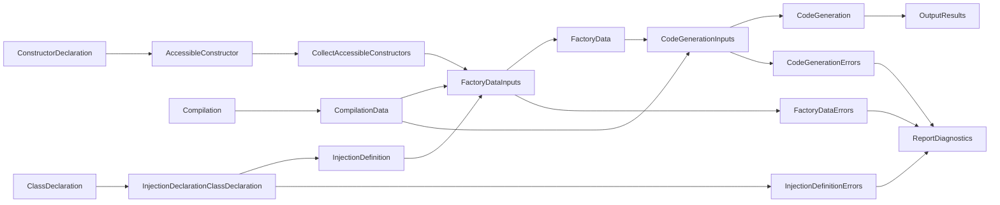

## Sundew.Injection.Generator

Sundew.Injection.Generator is an IncrementalGenerator that takes type registrations and mapping, turns it into a dependency tree, which in the end is evaluated into the source code for factory class that creates the object graph represented by the dependency tree.

### Pipeline

### Stages:
* CompilationData
  * Early extraction of compilation data, such as known types and compilation options
* AccessibleConstructors
  * Extract possible constructors
* InjectionDefinition
  * Extract all type mappings, registrations, configured constructors and life time scope information from all implementations of IInjectionDeclaration.
* FactoryData
  * Converts the InjectionDefinition and CompilationData into data about the factory. This include the name, factory methods and their dependency injection tree.
  * Resolves information about factories that are dependended upon by other factories.
* CodeGeneration
  * Converts the FactoryData into a data model representing the factory implementation and converts it to the factory source code.
* OutputResults
  * Emits the generated source code.